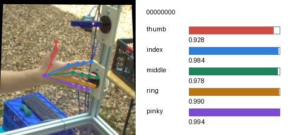
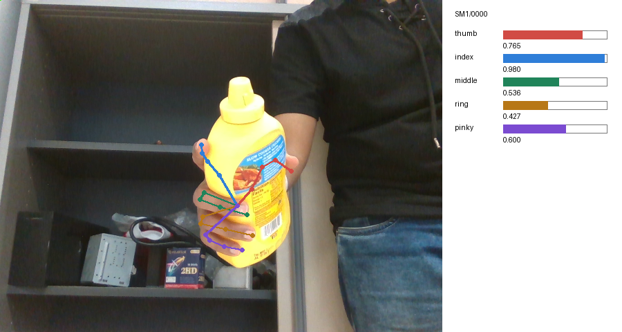
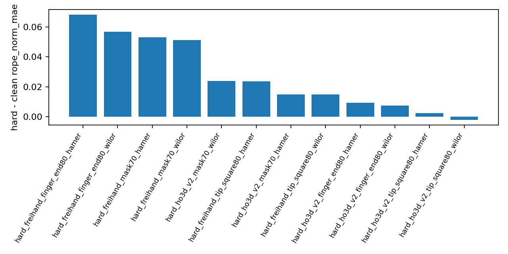
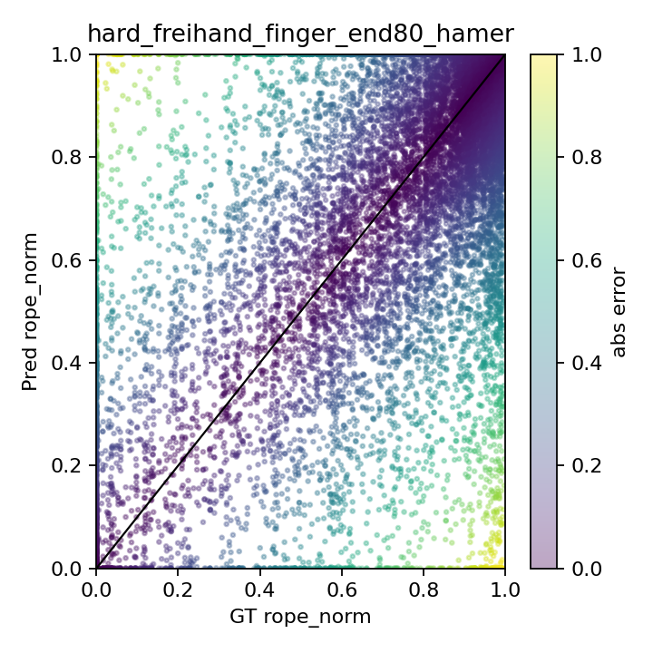
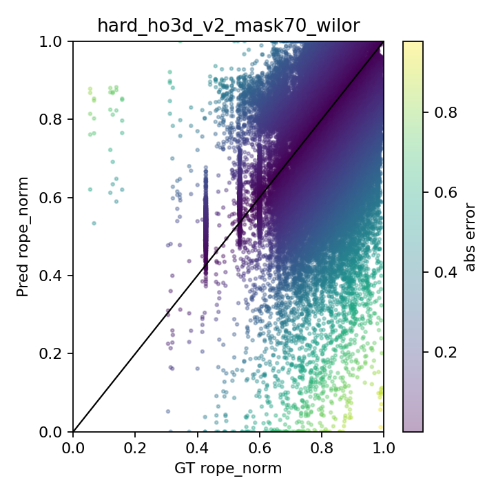

# Rope Diagnostic Reliability Check

Date: 2026-07-05

## Question

Before adding rope signals to training, check whether the rope label is useful
as a diagnostic signal on existing clean and hard baseline predictions.

The diagnostic compares five normalized wrist-to-tip distances:

- `gt_rope_norm[5]` from GT joints.
- `pred_rope_norm[5]` from exported baseline `pred.json` joints.
- `abs(pred_rope_norm - gt_rope_norm)` as the error.

Prediction normalization uses the GT finger-chain length, so a wrong predicted
hand scale cannot cancel the rope error.

## Rope Label Visuals

These examples show the GT hand-chain overlay and the five per-finger
`rope_norm` values used by the diagnostic.

## Outputs

Remote output root:

`/data/wentao/ropetrack/runs/rope_phase12_20260705_031056`

Report diagnostic output:

`/data/wentao/ropetrack/runs/rope_phase12_20260705_031056/diagnostics`

Local copied output:

`.local_checks/rope_phase12_20260705_031056/diagnostics`

Main generated files:

- `run_summary.tsv`
- `hard_clean_delta.tsv`
- `per_finger.tsv`
- `gt_bin_summary.tsv`
- `worst_cases.tsv`
- `figures/hard_clean_delta.png`
- `figures/scatter_*.png`
- `figures/worst_*.png`

## Main Result

The rope diagnostic is sensitive to hard occlusion. The strongest degradation is
on FreiHAND hard splits:

| Run | Delta rope_norm_mae over clean |
|---|---:|
| FreiHAND finger_end80 HaMeR | +0.068127 |
| FreiHAND finger_end80 WiLoR | +0.056781 |
| FreiHAND mask70 HaMeR | +0.053044 |
| FreiHAND mask70 WiLoR | +0.051303 |
| HO3D v2 mask70 WiLoR | +0.023835 |
| FreiHAND tip_square80 HaMeR | +0.023636 |
| HO3D v2 mask70 HaMeR | +0.014994 |
| FreiHAND tip_square80 WiLoR | +0.014747 |

HO3D v2 `tip_square80` is almost flat:

- HaMeR: `+0.002432`
- WiLoR: `-0.001981`

This matches the earlier hard-split readout: broad mask and finger-end
occlusion produce a stronger pose failure than a small fingertip square.

## Shape Of The Failure

The GT-bin analysis shows the failure is not just random noise.

On FreiHAND, closed fingers become much harder under hard splits:

| Run/bin | Count | MAE | Bias |
|---|---:|---:|---:|
| FreiHAND mask70 HaMeR, closed | 2728 | 0.316276 | +0.293416 |
| FreiHAND finger_end80 HaMeR, closed | 2728 | 0.275939 | +0.250788 |
| FreiHAND finger_end80 WiLoR, mid | 2792 | 0.218905 | +0.047460 |

Positive bias means the model predicts fingers as more open than GT. This is
useful: rope error is exposing a specific failure mode, not only repeating
standard MPJPE.

On HO3D v2, closed-bin errors are also high, but the closed-bin count is only
55 finger instances, so this should be treated as a caveat instead of a main
claim.

## Per-Finger Signal

FreiHAND hard splits show the largest per-finger errors on ring and pinky:

| Run | Finger | MAE | Bias |
|---|---|---:|---:|
| FreiHAND finger_end80 HaMeR | pinky | 0.198757 | +0.031495 |
| FreiHAND mask70 HaMeR | pinky | 0.192398 | +0.064278 |
| FreiHAND finger_end80 HaMeR | ring | 0.187795 | +0.027111 |
| FreiHAND finger_end80 WiLoR | pinky | 0.177806 | +0.011619 |
| FreiHAND mask70 WiLoR | pinky | 0.175908 | -0.002406 |
| HO3D v2 mask70 WiLoR | ring | 0.167085 | -0.102019 |

This suggests the rope signal is not equally informative for all fingers.
Training should probably start with all five values but monitor per-finger
losses separately.

## Interpretation

The diagnostic supports continuing with rope data, but only as a low-dimensional
constraint:

- It captures finger extension / contraction failure.
- It does not capture full 3D pose, hand orientation, lateral fingertip
  placement, or joint-angle plausibility.
- It should complement MPJPE/PCK and visualization, not replace them.

The most defensible next use is:

1. Keep generating `rope_norm[5]` labels as structured JSONL.
2. Use this diagnostic to select hard cases and compare clean vs hard behavior.
3. If training uses rope, start with an auxiliary loss or small conditioning
   module, and report per-finger / per-bin behavior instead of only one MAE.

## Recommended Report Claim

Without training, we verified that the proposed rope signal is not arbitrary:
it detects clean-to-hard degradation in baseline predictions, especially on
FreiHAND mask and finger-end occlusion. The signal is strongest for closed/mid
finger states and for ring/pinky failures, which suggests it can provide a
targeted extension-state constraint beyond ordinary pose metrics.
